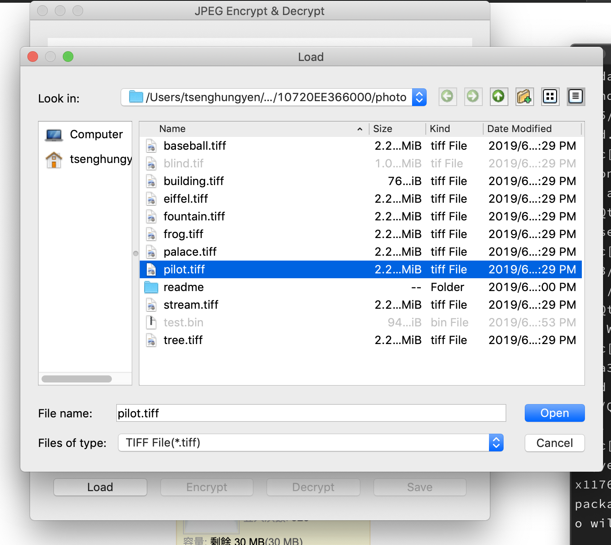
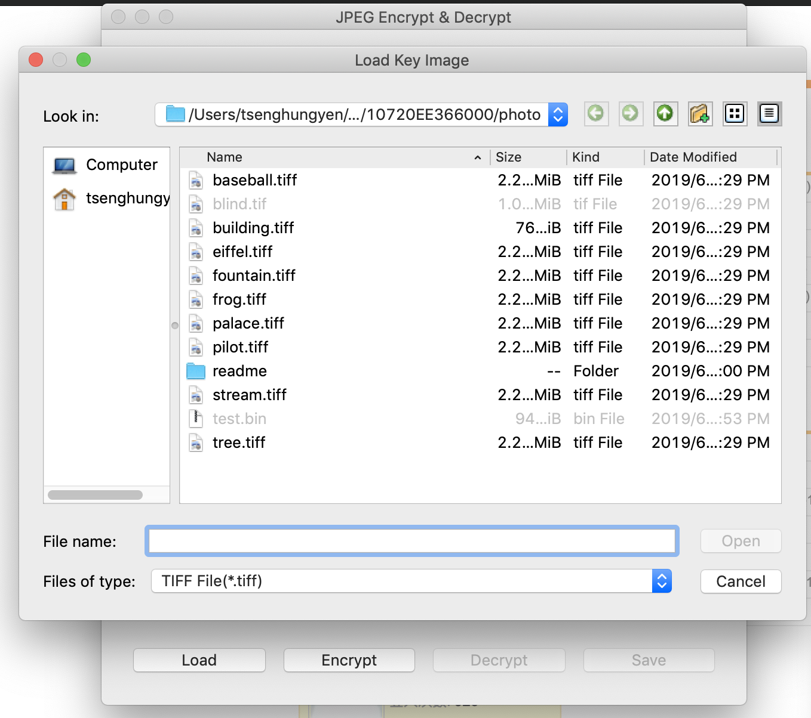
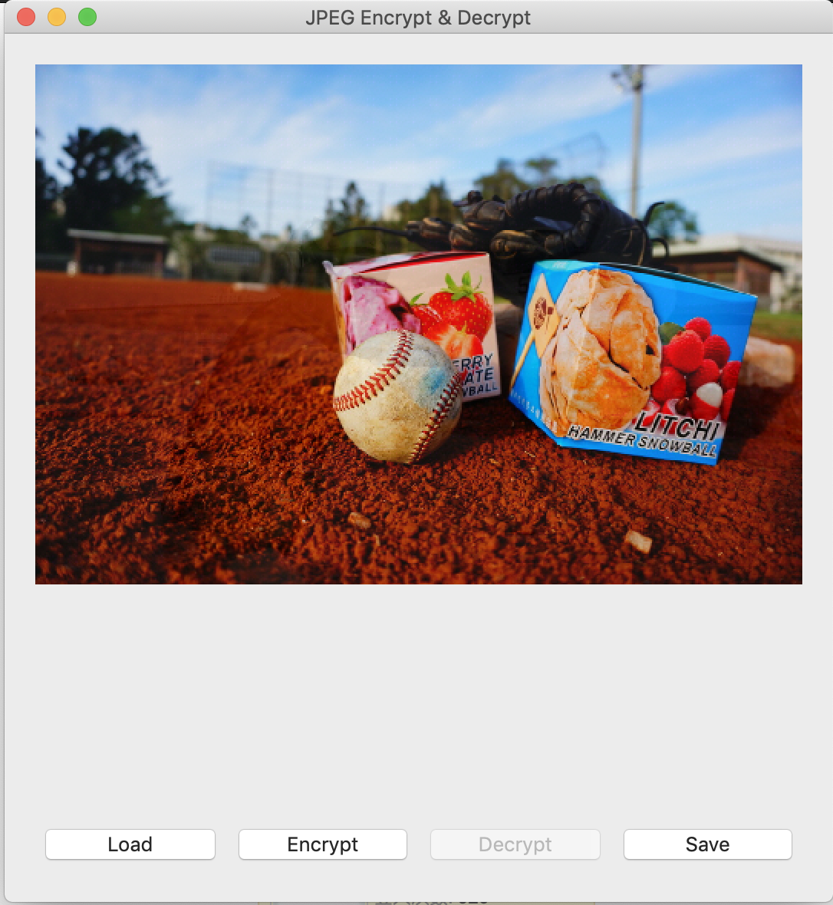
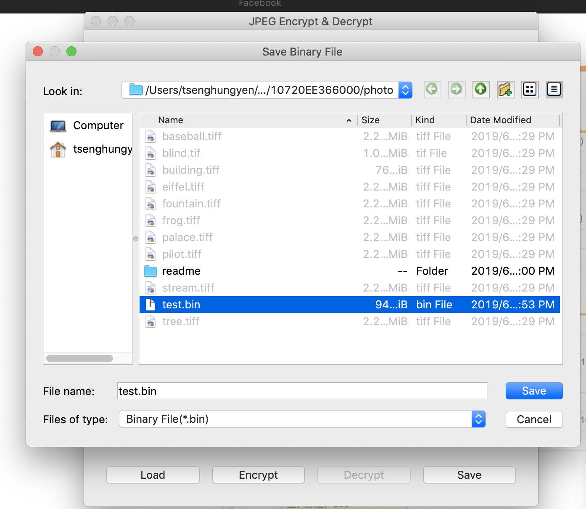
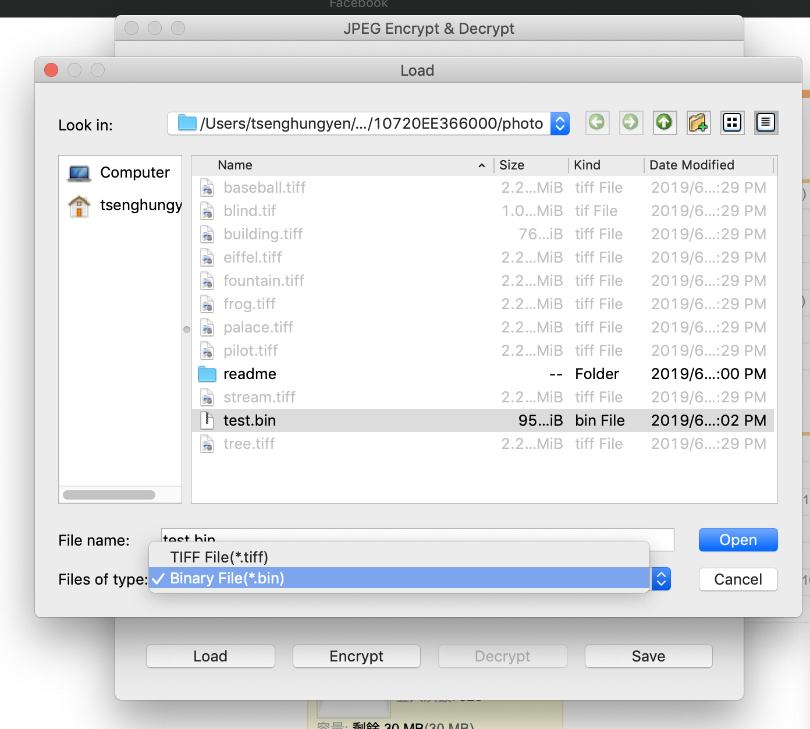
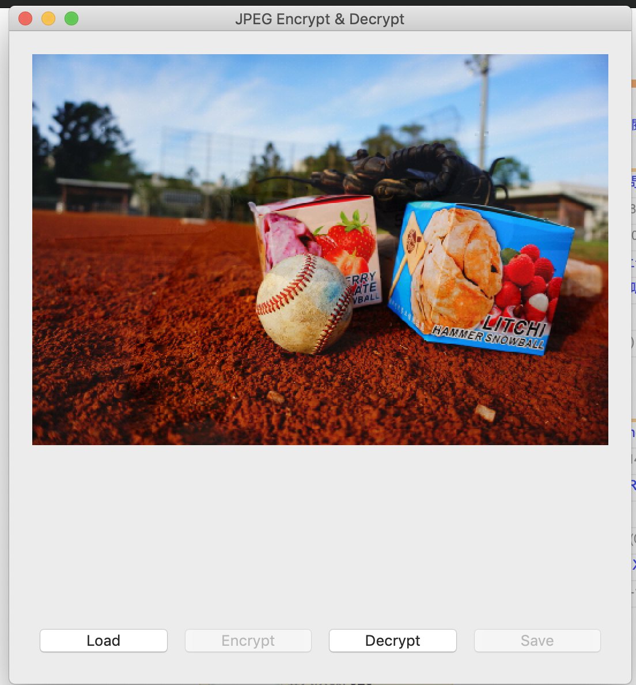
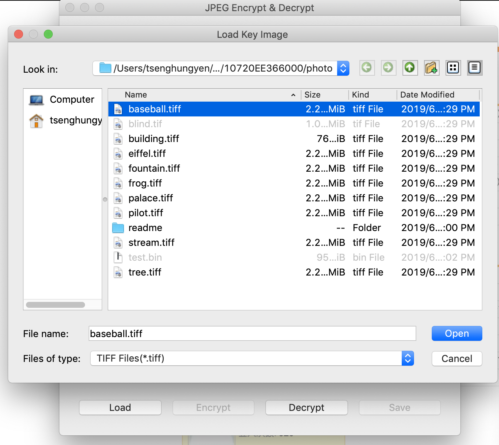
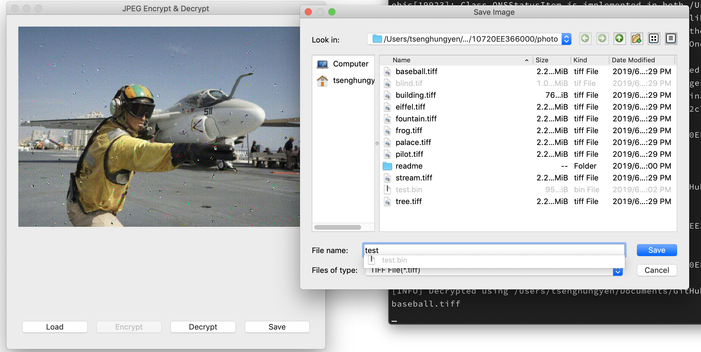

# Image Encrypting and Decrypting of JPEG

## Test Environment
1. Ubuntu 19.04 + Python 3.7.3
2. macOS 10.14.5 + Python 3.7.3

## Set up the environment

1. Install pip3.
`$ sudo apt install python3-pip`

2. Install the required packages.
`$ pip3 install -r requirements.txt`

## Usage

### CLI
1. List usage.
`$ python3 JEPGcrypto.py --help`

2. Encrypt image.
`$ python3 JEPGcrypto.py <path/to/orignal_image> <path/to/key_image>`

3. Decrypt image. Note: It may take at most 5 min to load.
`$ python3 JEPGcrypto.py <path/to/orignal_image> <path/to/key_image> -d`

1. Save result.
   - For encrypt mode:
     `$ python3 JEPGcrypto.py <path/to/orignal_image> <path/to/key_image> -o <path/to/result>`
   - For decrypt mode:
     `$ python3 JEPGcrypto.py <path/to/orignal_image> <path/to/key_image> -o <path/to/result> -d`
     

### GUI
`$ python3 gui.py`
1. Encrypt Image
   1. Load the image that wants to encrypt
      
      
   2. Click on "Encrypt".
      
   3. Load Key Image.
      
   4. Show the result.
      
   5. Save the result.
      

2. Decrypt Image
   1. Load binary file.  
      (It may take at most 5 min to load)
      
      
   1. Click on "Decrypt".
      
   2. Load Key Image.
      
   3. Save the result.
      
