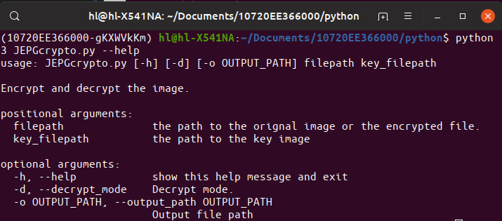
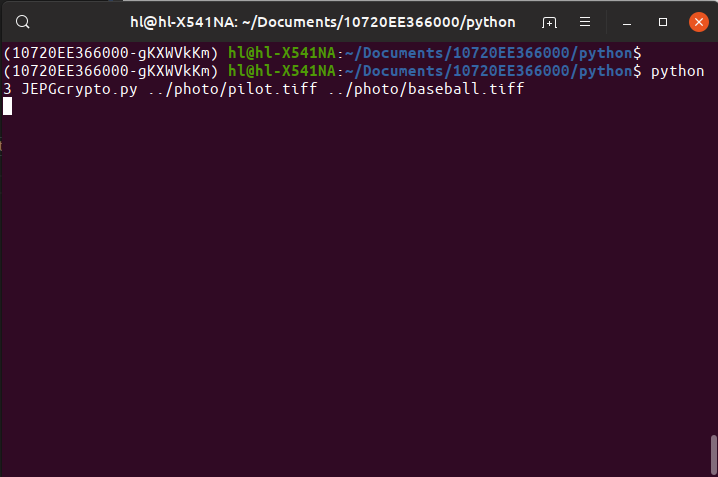
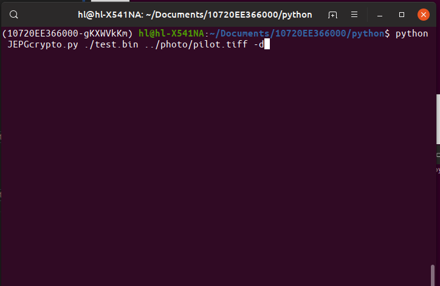
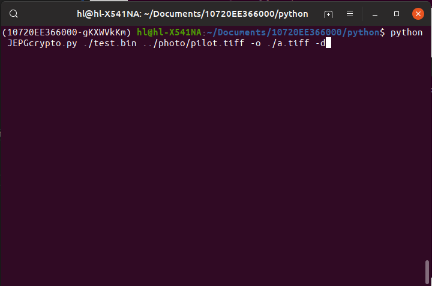

# Image Encrypting and Decrypting of JPEG

## Test Environment
1. Ubuntu 19.04 + Python 3.7.3
2. macOS 10.14.5 + Python 3.7.3

## Set up the environment

1. Install pip3.
`$ sudo apt install python3-pip`

2. Install the required packages.
`$ pip3 install -r requirements.txt`

## Usage

### CLI
1. List usage.
`$ python3 JEPGcrypto.py --help`

2. Encrypt image.
`$ python3 JEPGcrypto.py <path/to/orignal_image> <path/to/key_image>`

3. Decrypt image.
`$ python3 JEPGcrypto.py <path/to/orignal_image> <path/to/key_image> -d`

1. Save result.
   - For encrypt mode:
     `$ python3 JEPGcrypto.py <path/to/orignal_image> <path/to/key_image> -o <path/to/result>`
   - For decrypt mode:
     `$ python3 JEPGcrypto.py <path/to/orignal_image> <path/to/key_image> -o <path/to/result> -d`
     

### GUI
`$ python3 gui.py`
1. Encrypt Image
   
2. Decrypt Image
