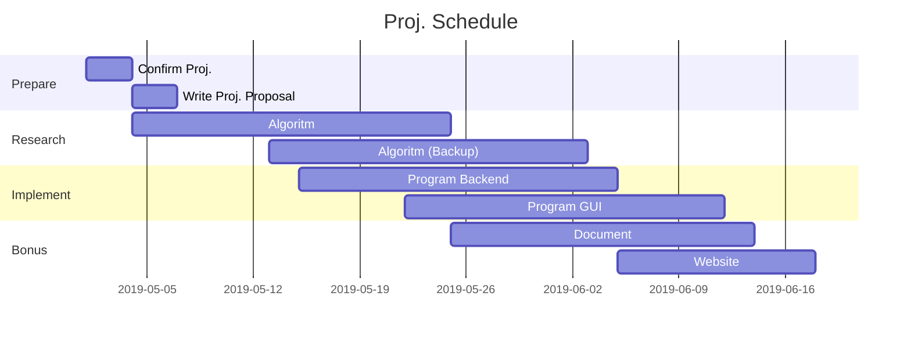

# Schedule

## Timetable

|      Week      |       Date        | Goal          | Note           |
| :------------: | :---------------: | :------------ | :------------- |
| [11](./worklog.md#week-11) | 2019-05-01 (Wed.) | Confirm Proj. |
| [12](./worklog.md#week-12) | 2019-05-08 (Wed.) |               |
| [13](./worklog.md#week-13) | 2019-05-15 (Wed.) |               |
| [14](./worklog.md#week-14) | 2019-05-22 (Wed.) |               | Proj. Proposal |
| [15](./worklog.md#week-15) | 2019-05-29 (Wed.) |               |
| [16](./worklog.md#week-16) | 2019-06-05 (Wed.) | Finish Proj.  |
| [17](./worklog.md#week-17) | 2019-06-12 (Wed.) | Proj. Hotfix  |
| [18](./worklog.md#week-18) | 2019-06-19 (Wed.) |               | Proj. Demo     |

## Gantt Graph

